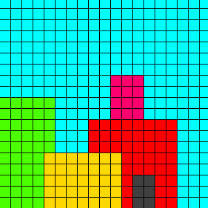
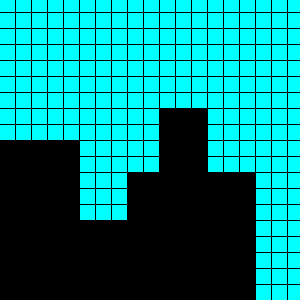
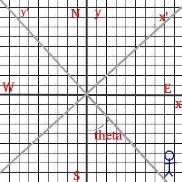

# CS Games 2017 - Algorithms - Skyline

As part of a start-up, one of the most important features of a successful
start-up office is to have the best view of the city than all other companies.

The Montreal city skyline is full of towers.  We want to get an idea of what
the skyline will look like.

## Challenge 1

Starting off simple, we want to know what the skyline's silhouette will look
like.  We know what buildings we are facing, we know their horizontal position,
their height, and their width.  Using this information, we want to determine
the edges of the silhouette.

### Problem

You are to create a program which takes an input file as its only argument, and
print out the data representing the silhouette.  The format of the input and
output are described below.

### Input

You will be given several a set of vectors which represent the a build.  The
vectors contain the position of the left side of the build, the height of the
building, and the width of the building.  (_i.e (x, h, w)_).

The first line of the input file will be a number _N_ which respresnts the
number of buildings present.  The next _N_ lines will be the a vector of
three values, each separated by a space.  The order of the values are: position
_x_, height _h_, and width _w_.

The values of the buildings are not in any particular order.


### Output

The output will be a sequence of numbers which represent the _x_, _z_ position
of the vertices of the silhouette.  Being a good computer scientist, we can
reduce the amound of output by observing that each edge is either vertical or
horizontal, not diagonal.  So, each successful vertex will have a common
component to the previous vertex.  We will only printout the different
component value each time.

The first vertex will be the most left vertex of the silhouette which we know
will start from a _z_ position of 0 (the ground), so the first value printed
will be the _x_ component of the first vertex.  The next value will be the _z_
position of the next vertex, as we know it will have the same _x_ value (being
a vertical line) as the first vertex.  The next value will be the _x_, then
_z_, and so on, until we print the _x_ component of the most right vertex
before the ground.  We can skip the last vertex as we know it will be _x_ of 0.


### Example

Input

```
5
0 10 5
12 3 2
8 8 8
4 5 7
10 12 3
```

Output

```
0
10
5
5
8
8
10
12
13
8
16
```

### Explanation

First, we need to visualize the buildings that are produced by the given input.



The different colours represent different buildings.  The 5 buildings in this example are partially overlapping, so they form one
blob of a silhouette, as shown in the image below.



From this, we can see that the first vertex is located at (0, 0).  Because it
is the first vertex, we know the _z_ component would be 0, so we only print the
_x_ component, 0.

The next vertex is the top left corner of the first building (the green one)
which is at _z_ position, 10.  The next position is the _x_ position of the top
right corner of the first building, 5.  This continues until the last vertex,
the top right corner of the red building, specifically its _x_ position, 16.

## Challenge 2

The next part of the challenge is to figure out the skyline of the buildings
that are at an angle of from the office view.  For this, we need a bit more
information about the buildings.  For this, we will be given the 3 dimensional
information about the buildings in Montreal.

For this, we know the position of the buildings West wall, South wall, its
height, its width (from East to West), and its depth (from South to North).

For this, a transformation of _x_ (East-West), and _Y_ (South-North)
coordinates to a new _x_, _y_ coordinates with respect to the view.

To save time, the transformation from (_x_, _y_) actual and (_x'_,
_y'_).

_x'_ = _x_ \* cos(θ) + _y_ \* sin(θ)

_y'_ = _y_ \* cos(θ) - _x_ \* sin(θ)



### Problem

Same as challenge 1, but now the silhouette is with respect to a given angle.

_Node: you do NOT need to acount for view angle._

### Input

The first line will contain 2 number, a value _N_ representing the number of
buildings that will follow, and _θ_ the view angle in degress.

The next _N_ lines will contain 5 values.  These values represent the position
and dimensions of a building (all retangular prisms).  The vector _x_, _y_,
_h_, _w_, _d_.  Where _x_ and _y_ are the unaltered coordinates of the South-
West corner of the building, _h_ is the height, _w_ is the width (along the
_x_ axis), and _d_ is the depth (along the _y_ axis).

### Output

The output is the same as challenge 1, but with respect to the view angle.

Imagine that the view point is somewhere on the negative _y'_ axis looking
towards the buildings.

### Example

Input

```
3 30
-3 0 7 2 3
-2 -3 3 2 2
1 -1 5 2 2
```

Output

```
-3.23
3
-2.60
7
0.63
5
3.10
```
